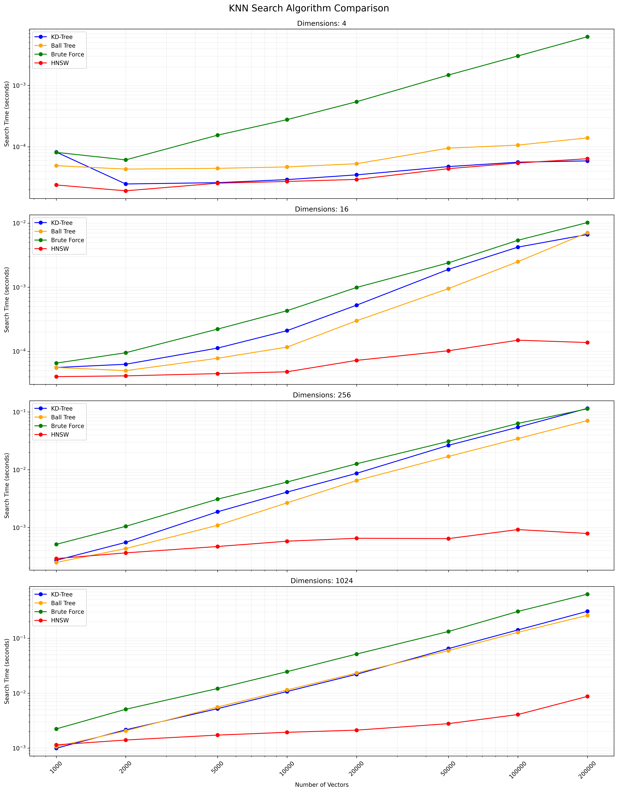

# KNN Search Algorithm Comparison

The K-nearest neighbors (k-NN) algorithm, introduced in 1951, has been widely used for both classification and regression tasks. The core concept involves identifying the k most similar instances (neighbors) to a given query point within a dataset and using these neighbors to make predictions or classifications. In recent years, the importance of vector databases and vector indexes has grown, particularly for information retrieval to support large language models (LLMs) in processing extensive datasets of text and other data. A prominent example of this application is retrieval-augmented generation (RAG).

This project compares the performance of different k-NN search algorithms across various dataset sizes and dimensions. The algorithms compared are:

1. KD-Tree
2. Ball Tree
3. Brute Force (Full KNN)
4. HNSW (Hierarchical Navigable Small World)

## Algorithm Explanations

1. KD-Tree (K-Dimensional Tree):
   - A space-partitioning data structure for organizing points in a k-dimensional space.
   - Builds a binary tree by recursively splitting the space along different dimensions.
   - Efficient for low-dimensional spaces (typically < 20 dimensions).
   - Average time complexity for search: O(log n), where n is the number of points.
   - Less effective in high-dimensional spaces due to the "curse of dimensionality".
   Example: In a 2D space, a KD-Tree might split the plane vertically, then horizontally, alternating at each level:
   ```
      y
      |
   4  |    C
      |  A   D
   2  |    B
      |___________
      0    2    4  x
   ```
   Points: A(1,3), B(3,1), C(4,3), D(3,3)
   Tree structure: Root(x=2) -> Left(y=2) -> Right(x=3)

2. Ball Tree:
   - A binary tree data structure that partitions points into nested hyperspheres.
   - Each node represents a ball (hypersphere) containing a subset of the points.
   - More effective than KD-Tree for high-dimensional spaces.
   - Average time complexity for search: O(log n), but with higher constant factors than KD-Tree.
   - Generally performs better than KD-Tree when dimensions > 20.
   Example: In a 2D space, a Ball Tree might create nested circles:
   ```
      y
      |
   4  |    (C)
      |  (A)  (D)
   2  |    (B)
      |___________
      0    2    4  x
   ```
   Outer circle contains all points, inner circles divide subsets.

3. Full KNN (Brute Force):
   - Computes distances from the query point to all other points in the dataset.
   - Simple to implement but computationally expensive for large datasets.
   - Time complexity: O(n * d), where n is the number of points and d is the number of dimensions.
   - Becomes inefficient as the dataset size or dimensionality increases.
   - Guaranteed to find the exact nearest neighbors.
   Example: For a query point Q(2,2) and K=2:
   ```
      y
      |
   4  |    C
      |  A   D
   2  |----Q--B
      |___________
      0    2    4  x
   ```
   Calculate distances: QA=1.41, QB=1, QC=2.24, QD=1.41
   Result: Nearest 2 neighbors are B and A (or D)

4. HNSW (Hierarchical Navigable Small World):
   - An approximate nearest neighbor search algorithm.
   - Builds a multi-layer graph structure for efficient navigation.
   - Provides a trade-off between search speed and accuracy.
   - Performs well in high-dimensional spaces and with large datasets.
   - Average time complexity for search: O(log n), but with better constants than tree-based methods.
   - Allows for faster searches by sacrificing some accuracy.
   Example: A simplified 2D representation of HNSW layers:
   ```
   Layer 2:   A --- C
              |
   Layer 1:   A --- B --- C
              | \   | \   |
   Layer 0:   A --- B --- C --- D --- E
   ```
   Search starts at a random point in the top layer and descends, 
   exploring neighbors at each level until reaching the bottom.

The choice between these algorithms depends on the dataset size, dimensionality, required accuracy, and query speed.
KD-Tree and Ball Tree provide exact results and are efficient for low to moderate dimensions.
Full KNN is simple but becomes slow for large datasets.
HNSW offers a good balance between speed and accuracy, especially for high-dimensional data or large datasets.

## Installation

1. Clone this repository:
   ```
   git clone https://github.com/yourusername/knn-search-comparison.git
   cd knn-search-comparison
   ```

2. Create a virtual environment (optional but recommended):
   ```
   python -m venv venv
   source venv/bin/activate  # On Windows, use `venv\Scripts\activate`
   ```

3. Install the required dependencies:
   ```
   pip install -r requirements.txt
   ```

   This will install all necessary packages listed in the `requirements.txt` file, including numpy, scipy, scikit-learn, hnswlib, tabulate, and tqdm.

## Usage

To run the comparison tests with default parameters:

```
python app.py
```

You can also customize the test parameters using command-line arguments:

```
python app.py --vectors 1000 10000 100000 --dimensions 4 16 256 --num-tests 5 --k 5
```

Available arguments:
- `--vectors`: List of vector counts to test (default: 1000, 2000, 5000, 10000, 20000, 50000, 100000, 200000)
- `--dimensions`: List of dimensions to test (default: 4 16 256 1024)
- `--num-tests`: Number of tests to run for each combination (default: 10)
- `--k`: Number of nearest neighbors to search for (default: 10)

The script will display a progress bar during execution, giving you an estimate of the remaining time.

The script can be interrupted at any time by pressing Ctrl+C. It will attempt to exit gracefully, even during time-consuming operations like building the HNSW index.

## Output

The script will display progress and results in the console. After completion, you'll see:

1. A summary of results for each combination of vector count and dimensions, including:
   - Build times for KD-Tree, Ball Tree, and HNSW index
   - Average search times for each algorithm
2. A table of all results
3. The location of the CSV file containing detailed results

Example output for a single combination:

```
Results for 10000 vectors with 256 dimensions:
KD-Tree build time:       0.123456 seconds
Ball Tree build time:     0.234567 seconds
HNSW build time:          0.345678 seconds
KD-Tree search time:      0.001234 seconds
Ball Tree search time:    0.002345 seconds
Brute Force search time:  0.012345 seconds
HNSW search time:         0.000123 seconds
```

The final results table and CSV file will include both build times and search times for each algorithm, allowing for a comprehensive comparison of performance across different vector counts and dimensions.

## Customization

You can modify the following variables in `app.py` to adjust the test parameters:

- `NUM_VECTORS_LIST`: List of vector counts to test
- `NUM_DIMENSIONS_LIST`: List of dimensions to test
- `NUM_TESTS`: Number of tests to run for each combination
- `K`: Number of nearest neighbors to search for

## Contributing

Contributions are welcome! Please feel free to submit a Pull Request.

## License

This project is open source and available under the [MIT License](LICENSE).

## KNN Search Results Chart

Below is a chart showing the KNN search results:



A CSV file containing the detailed results is available [here](knn_search_results.csv).
